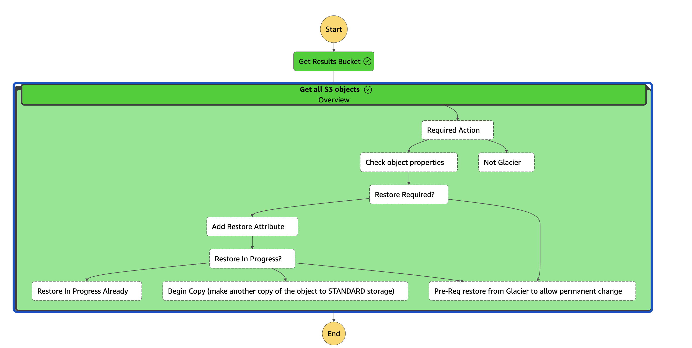

# Restore objects from Glacier Storage to Standard storage

## Problem Statement

Once objects are moved to S3 Glacier storage, they are inaccessible without being temporarily retreived. 

If applications need to access this data in real time, this can cause issues for example if it were a single page application or if a database needed to retreive files for restoration.

## Solution

### Considerations on approach

#### AWS Lambda + AWS Stepfunction combination

#### AWS Batch
AWS [S3 Batch](https://docs.aws.amazon.com/AmazonS3/latest/userguide/batch-ops.html) is how typically in the past operators would restore large number of files from GLACIER storage to standard.

This process requires an input of [AWS S3 Inventory](https://docs.aws.amazon.com/AmazonS3/latest/userguide/storage-inventory.html#:~:text=output%20files%20that%20list%20your%20objects%20and%20their%20corresponding%20metadata%20on%20a%20daily%20or%20weekly%20basis%20for%20an%20S3%20bucket) which returns a list of objects at the shortest interval of 1 day.

## Overview of the stepfunction

### Stepfunction Diagram

### Stepfunction input

Navigate to the AWS Console and click on the `Step Functions` service tab.
Locate the Stepfunction with name `GlacierMoverStepfunction`.
Invoke the stepfunction with the below input:

~~~json
{
  "bucket_name": "my_sample_bucket"
}
~~~
*Where `"my_sample_bucket"` is in the same account OR can be read by the defined role*

### Feedback ?

We'd love to hear from you, raise an issue or discussion to get the conversation started
